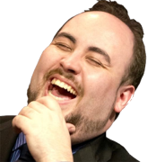
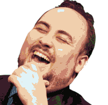
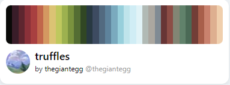

# PaletteSwatcher
 
A small program used for the adjustment of a image or multiple images to follow a specific palette of colors.\
This program is able to run a test-output on one or more images with one or more palettes into a each of these combinations of outputs.

After a palette has been chosen, you can input a path, where all files in the path(including subfolders) will be targetted, and converted, based on the palette.
# Before & After

\
This was the result from the following palette:
\
